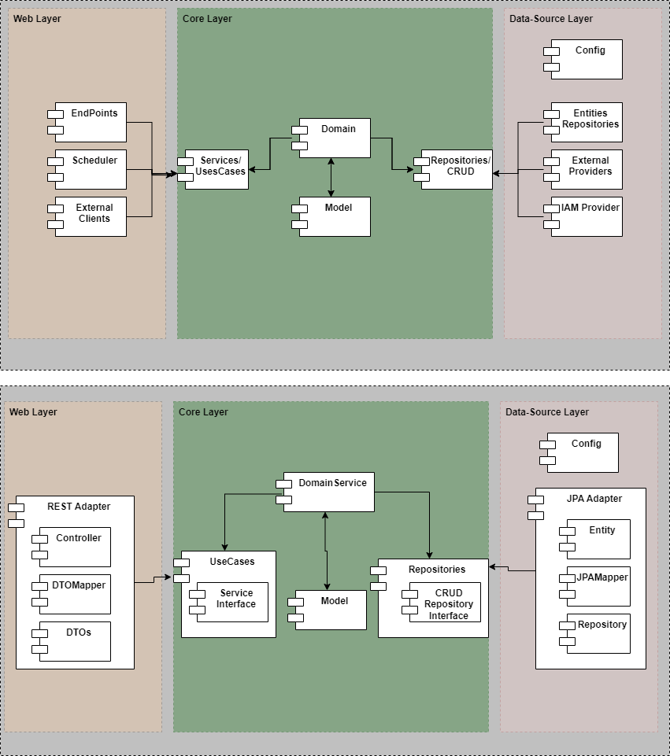

# User Management Micro-Service

This is a demo Spring Boot project for the creation and querying of users.

## Key Features

- JWT service
- User Management

## Architecture

This application is designed based on the Hexagonal Architecture, also known as Ports and Adapters architecture. The main idea behind this architecture is to decouple the core business logic of the application from external dependencies, such as databases, UI frameworks, and other external systems.

Firstly, we define the principles for dividing our code. The hexagonal architecture defines the internal and external parts.

What we did was divide our application into three layers: Web (external), core (internal), and data-source (external).



## Core Layer

The `core` module contains the core components of the application.

* Model: This folder holds the domain models or entities of the application. These models represent the core business concepts and encapsulate the data and behavior related to them.
* Domain: This folder contains domain services that encapsulate complex business logic not fitting naturally within a specific entity. Domain services implement the business logic associated with each use case and orchestrate the interactions between the domain models, services, and repositories.
* Service: This folder represents the application's use cases. The Use cases define the specific actions or tasks that the application can perform to fulfill user requirements. Each use case typically corresponds to a specific user goal or action.
* Repo: The repositories layer provides an interface for interacting with the underlying data storage. They typically encapsulate operations related to CRUD (Create, Read, Update, Delete) operations.

## Web Layer

The `Web` module is responsible for handling the communication and interaction between the application and external systems or user interfaces.

## Data Source Layer

The `data` module is responsible for managing the data persistence and external service integration aspects of the application.

## Installation and Usage

### Prerequisites

-[Java SE Development Kit 11.0.20](https://www.oracle.com/co/java/technologies/javase/jdk11-archive-downloads.html) - The software that provides development tools for creating Java programs.

-[Gradle](https://gradle.org/install) - Is a build automation tool for multi-language software development.

-[Git](https://gitforwindows.org/) -  It is a distributed version control system.

### Clone the GitHub repository from the terminal.

```bash
git clone https://github.com/ferneybaron/user-management-ms.git
```

### Build the Application

```bash
./gradlew build
```

### Run the Application
```bash
./gradlew bootRun
```

### OpenAPI definition
```
http://localhost:8080/user-management/swagger-ui/index.html
```

### Jacoco Resources
```
build/jacocoHtml/index.html
```

### cURL sign-up
```bash
curl --location 'localhost:8080/user-management/api/v1/sign-up' \
--header 'Content-Type: application/json' \
--data-raw '{
    "name": "Julio Gonzalez",
    "email": "julio@testssw.cl",
    "password": "a2asfGfdfdf4",
    "phones": [
        {
            "number": 87650009,
            "cityCode": 7,
            "countryCode": "25"
        }
    ]
}'
```

### cURL login
```bash
curl --location 'localhost:8080/api/v1/login' \
--header 'Content-Type: application/json' \
--data '{
    "token": "YOUR_TOKEN"
}'
```